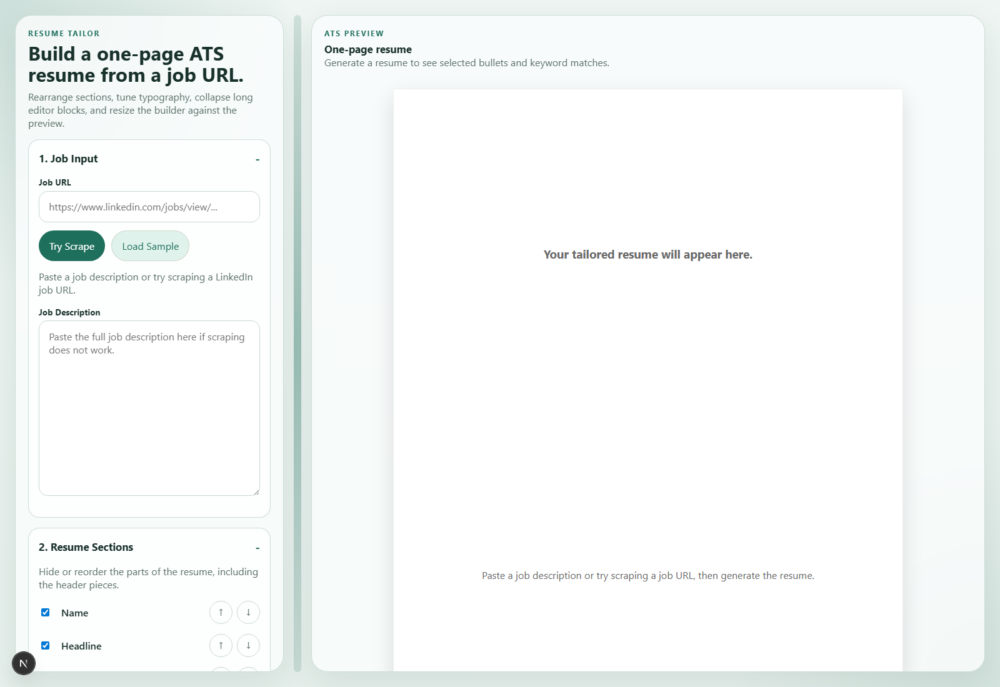
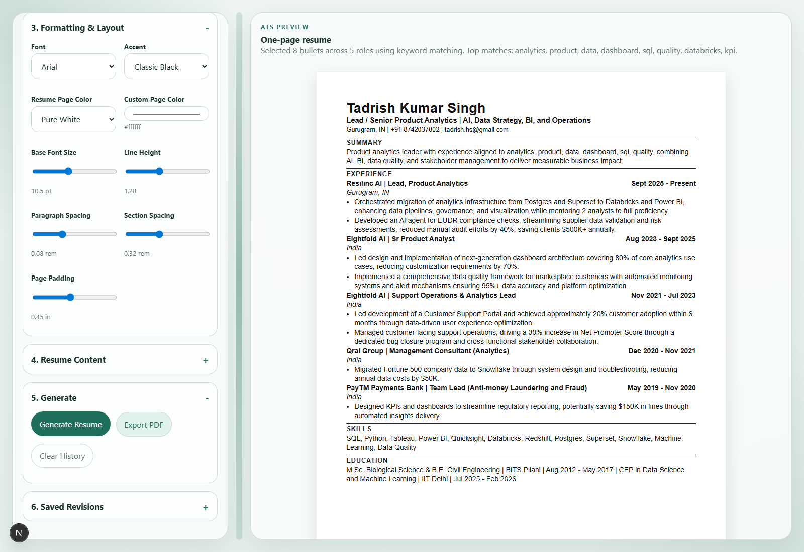
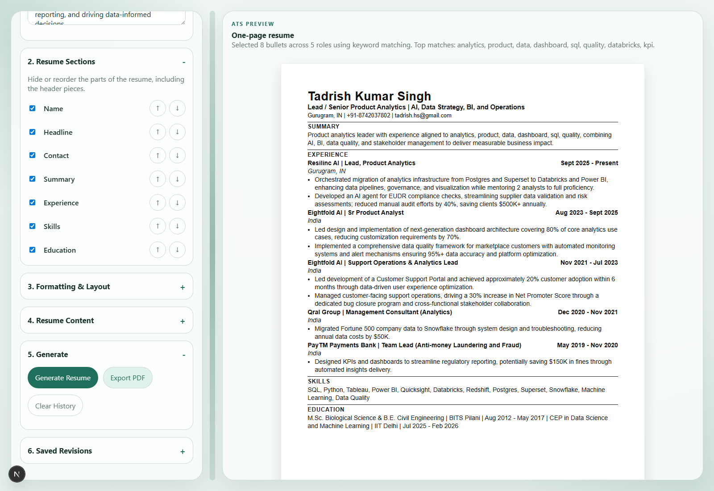

# Resume Tailor

Resume Tailor is a Next.js app for generating a one-page ATS-friendly resume from a job URL or pasted job description.

It is designed for a single-user workflow where you maintain a larger bullet bank for each role, then generate a tailored resume by selecting the most relevant existing points for a target job description.

## Screenshots

### Studio Overview



### Generated Resume Preview



### Formatting Controls



## What the app does

- Accepts a job URL and attempts server-side extraction of the job description
- Falls back to manual job description paste if scraping fails
- Lets you add, edit, remove, and reorder work experiences
- Lets you add, edit, remove, and reorder bullets under each experience
- Lets you hide and reorder resume sections such as name, headline, contact, summary, skills, and education
- Matches the most relevant existing bullets using keyword scoring against the job description
- Generates a one-page ATS-style resume preview
- Supports print-to-PDF export
- Stores the current profile and revision history in browser local storage
- Includes formatting controls for fonts, spacing, accent color, and resume page color

## Current product scope

This version is intentionally optimized for:

- Single-user personal usage
- ATS-friendly plain resume output
- Existing-bullet selection only
- LinkedIn-first workflow with manual paste fallback

This version does not yet:

- Use an LLM to rewrite bullet points
- Support multi-user authentication
- Persist data to a database
- Guarantee LinkedIn scraping for every listing

## Tech stack

- Next.js 16 App Router
- React 19
- Server route for job scraping at `app/api/scrape/route.js`
- Browser local storage for profile and revision persistence
- Playwright for generating README screenshots

## Project structure

```text
app/
  api/scrape/route.js     Server-side job description extraction
  globals.css             Application and preview styling
  layout.js               Root layout
  page.js                 Main resume studio UI
docs/
  images/                 README screenshots
lib/
  default-resume.js       Seed resume data
  resume-utils.js         Keyword matching and resume generation logic
scripts/
  take-screenshots.mjs    Regenerates README screenshots
```

## How resume generation works

1. You enter a job URL or paste a job description.
2. The app extracts keywords from the job description.
3. Each stored resume bullet is scored against those keywords.
4. The app picks the highest-scoring existing bullets.
5. The selected bullets are rendered into a one-page resume preview.
6. You can export the preview as a PDF using the browser print flow.

## Running locally

### Prerequisites

- Node.js
- npm

On Windows PowerShell, use `npm.cmd` if script execution blocks `npm`.

### Install dependencies

```powershell
npm.cmd install
```

### Start the development server

```powershell
npm.cmd run dev
```

Then open [http://localhost:3000](http://localhost:3000).

### Production build

```powershell
npm.cmd run build
npm.cmd run start
```

## Regenerating screenshots

Start the app locally first, then run:

```powershell
node .\scripts\take-screenshots.mjs
```

This refreshes the images in `docs/images/`.

## Usage flow

### 1. Provide a target job

- Paste a LinkedIn job URL and try scraping
- If scraping fails, paste the job description manually

### 2. Maintain your resume content

- Add new work experiences
- Reorder experiences
- Add new bullet points to any role
- Reorder bullets within a role
- Remove bullets or whole experiences

### 3. Customize layout

- Reorder resume sections
- Hide sections you do not want to show
- Change font family
- Adjust font size, line height, paragraph spacing, section spacing, and page padding
- Change accent color
- Change resume page color with presets or the custom color picker
- Resize the editor and preview panels

### 4. Generate and export

- Click `Generate Resume`
- Review the one-page preview
- Export to PDF using the built-in print flow

## Notes on scraping

- LinkedIn pages are often protected and may block direct extraction.
- The app uses a best-effort server-side approach.
- Manual job description paste is the reliable fallback and should always be available.

## Notes on persistence

- Profile data is stored in the browser using local storage.
- Saved revisions are also stored locally in the browser.
- Clearing browser storage will remove local app history.

## Future improvements

- Database-backed persistence
- Auth and multi-profile support
- Smarter semantic ranking beyond keyword matching
- LLM-assisted bullet refinement as an optional mode
- Better scrape adapters for Greenhouse, Lever, and more job boards
- DOCX/PDF import and export workflows

## License

Currently unlicensed for private project use unless you choose to add a license file.
